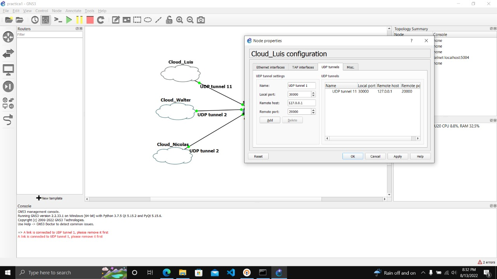
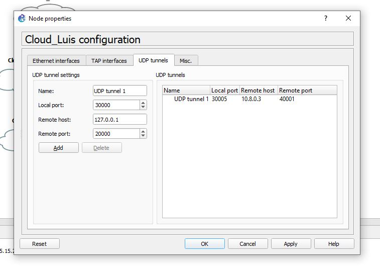
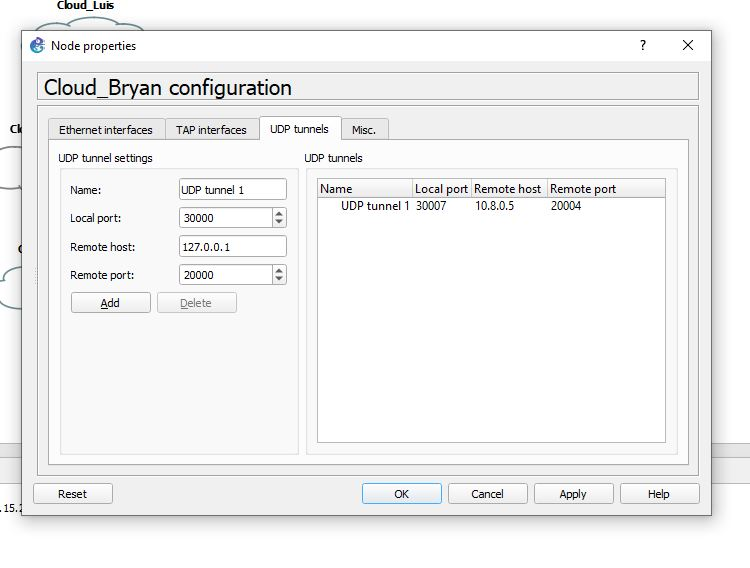
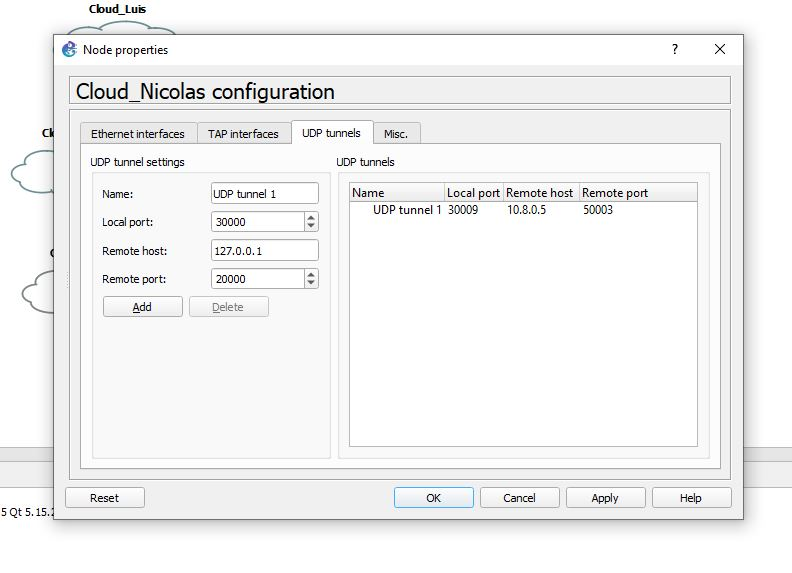
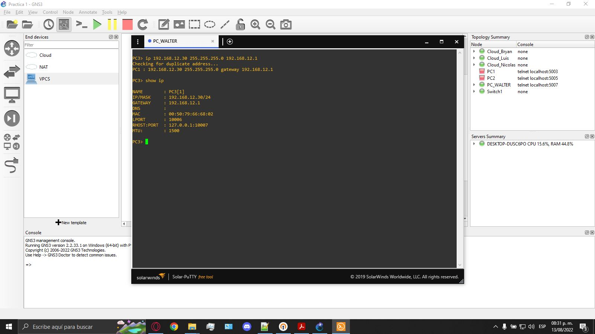
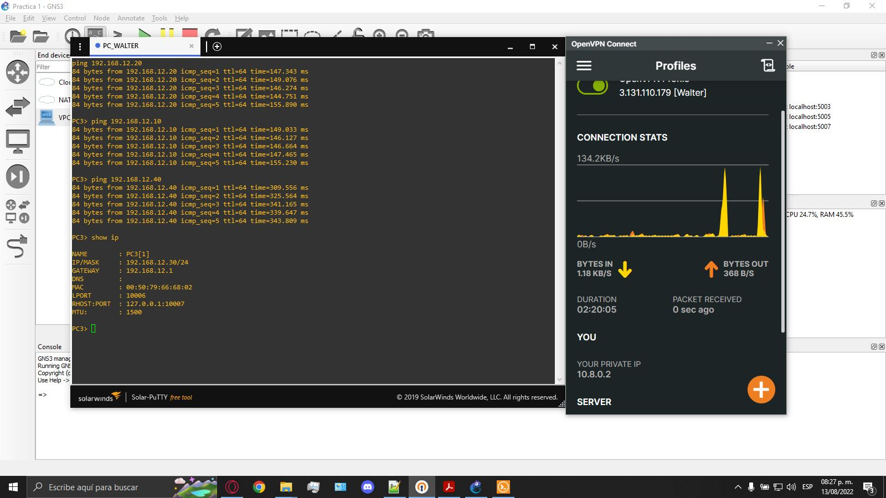

# Redes 1: Practica 1 
|Grupo 2| Carnet | Nombre |
| --- | --- | --- |
| Coordinador |  | |
| Compañero 2 | 201602880 | Bryan Alexander Portillo Alvarado  |
| Compañero 3 | 201709073 | Walter Alexander Guerra Duque |
| Compañero 4 | 201403793 | Kevin Nicolas Garcia Martinez |

## Configuracion de las nubes
Cada integrante del grupo configuro 3 clouds en las cuales se ingresaron puertos locales y remotos segun el host del compañero al que se deseaba hacer la conexion.
### Coordinador
- Compañero 2

- Compañero 3

- Compañero 4

### Compañero 2
- Coordinador

- Compañero 3

- Compañero 4

### Compañero 3
- Coordinador

- Compañero 2

- Compañero 4

### Compañero 4
- Coordinador

- Compañero 2

- Compañero 3

## Configuracion de las VPCs y Ping entre los hosts
Cada integrante conto con una VPC la cual se iniciaba y se entraba a su consola, se ingresaba el comando `ip` seguido de los parametros la ip deseada, la mascara de subred y el gateway. Luego de esto y conectar todas las nubes y la VPC al switch se procede a hacer ping entre hosts con el comando `ping`.
### Coordinador

- VPC

- Ping

### Compañero 2

- mediante el comando ip se asigno la direccion, mascara de subred y puerta de enlace mostrados en la siguiente figura

- correspondiente con la ip asignada 192.168.12.20 se procedio a realizar mediante el comando ping hacia los otros hosts, para verificar conexion entre ellos, como se muestra en la figura

### Compañero 3

- Configuracion VPC:  ip: 192.168.12.30, mascara: 255.255.255.0 y gateway 192.168.12.1  

- Ping a: Coordinador, Compañero 3 y Compañero 4

### Compañero 4

- VPC

- Ping
